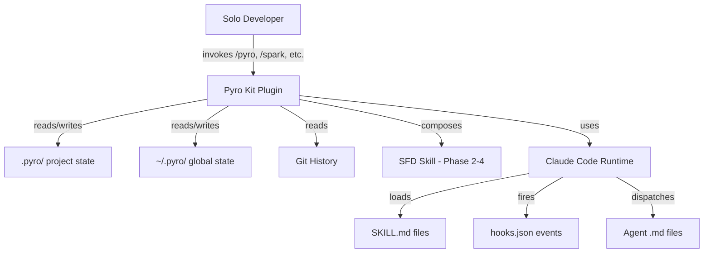
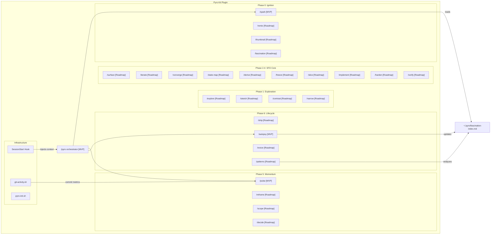
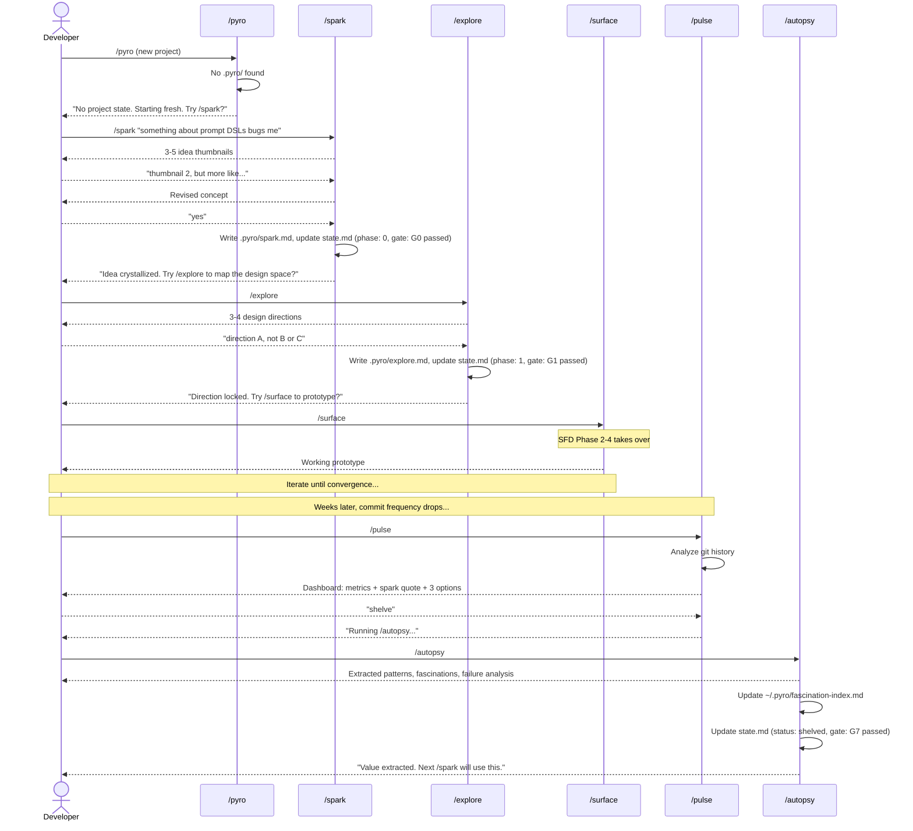

# Solution Design Document

## Validation Checklist

### CRITICAL GATES (Must Pass)

- [x] All required sections are complete
- [x] No [NEEDS CLARIFICATION] markers remain
- [x] Architecture pattern is clearly stated with rationale
- [x] **All architecture decisions confirmed by user**
- [x] Every interface has specification

### QUALITY CHECKS (Should Pass)

- [x] All context sources are listed with relevance ratings
- [x] Project commands are discovered from actual project files
- [x] Constraints -> Strategy -> Design -> Implementation path is logical
- [x] Every component in diagram has directory mapping
- [x] Error handling covers all error types
- [x] Quality requirements are specific and measurable
- [x] Component names consistent across diagrams
- [x] A developer could implement from this design

---

## Scope

| Version | Components | Status |
|---------|-----------|--------|
| **v0.1.0 (MVP)** | Plugin scaffold, 4 SKILL.md files, 1 agent, 3 scripts, hooks, 9 reference files, state schemas | **Shipped** |
| **v1.0.0 (Full Vision)** | Full 27-skill framework with SFD integration | Roadmap |

This SDD describes the **full v1.0.0 architecture**. Components shipped in v0.1.0 are tagged `[MVP]` in the Building Block View.

## Constraints

- **CON-1 Platform**: Claude Code plugin architecture only. SKILL.md format for skills, `.md` for agents, `hooks.json` for hooks, `plugin.json` for manifest. No external runtimes.
- **CON-2 State**: All state in local filesystem. `.pyro/` per project, `~/.pyro/` global. No databases, no cloud services, no external dependencies.
- **CON-3 Interaction**: Every skill must follow propose-react-iterate. No Socratic questioning. The first output of every skill is a concrete proposal, never an open-ended question.
- **CON-4 Context Budget**: Each SKILL.md must be < 500 lines. Reference files loaded on demand via progressive disclosure. State files size-limited (state.md < 100 lines).
- **CON-5 Skill Count**: Target 20-28 skills across 7 phases. Lean enough to be learnable, comprehensive enough to cover the full lifecycle.
- **CON-6 Solo Use**: Single developer only. No team features, shared state, or collaboration workflows.

## Implementation Context

### Required Context Sources

#### Documentation Context
```yaml
- doc: ~/projects/agents/surface-first-development/skills/surface-first/Surface-First_Development_-_Whitepaper_v0_6.md
  relevance: CRITICAL
  why: "SFD methodology — the philosophical foundation for the entire framework"

- doc: ~/projects/agents/surface-first-development/skills/surface-first/SKILL.md
  relevance: HIGH
  why: "SFD operational skill — Phases 2-4 of Pyro Kit derive from this directly"

- doc: .internal/research/ideation-research/13-pyro-kit-feasibility.md
  relevance: HIGH
  why: "Gap analysis, psychology research, component analysis"

- doc: .internal/research/ideation-research/12-solo-creative-developer-tools.md
  relevance: MEDIUM
  why: "Landscape of 30+ existing tools — what to compose vs build"
```

#### Code Context
```yaml
- file: ~/.claude/plugins/cache/the-startup/start/3.2.1/skills/
  relevance: HIGH
  why: "Reference implementation of PICS+Workflow skill format — Pyro Kit will follow this pattern"

- file: ~/projects/agents/surface-first-development/skills/surface-first/SKILL.md
  relevance: HIGH
  why: "SFD skill to be composed into Phase 2-4 skills"
```

### Implementation Boundaries

- **Must Preserve**: Surface-First Development's core principles (propose-react-iterate, recognition > generation, surface as product anchor). SFD's existing SKILL.md should remain usable standalone.
- **Can Modify**: All new files created for Pyro Kit. The fascination index format and state file schemas are new and can evolve.
- **Must Not Touch**: Existing Claude Code plugin infrastructure, other installed plugins/skills, user's project code.

### External Interfaces

#### System Context Diagram



#### Interface Specifications

```yaml
# Inbound Interfaces
inbound:
  - name: "Slash Commands"
    type: Claude Code skill invocation
    format: /skill-name [arguments]
    authentication: None (local CLI)
    data_flow: "Developer invokes skills via /command or Claude auto-loads based on description match"

  - name: "Session Hooks"
    type: Claude Code hooks.json
    format: SessionStart event
    authentication: None
    data_flow: "Framework injects context at session start; detects dormancy"

# Outbound Interfaces
outbound:
  - name: "Filesystem (Project State)"
    type: Local filesystem
    format: Markdown + YAML frontmatter
    data_flow: "Skills read/write .pyro/ directory in project root"
    criticality: HIGH

  - name: "Filesystem (Global State)"
    type: Local filesystem
    format: Markdown + YAML
    data_flow: "Skills read/write ~/.pyro/ for cross-project data"
    criticality: HIGH

  - name: "Git CLI"
    type: Shell command (git)
    format: git log, git diff, git branch
    data_flow: "/pulse reads git history for activity metrics"
    criticality: MEDIUM

# Data Interfaces
data:
  - name: "Project State (.pyro/)"
    type: Filesystem directory
    data_flow: "Per-project tracking: phase, spark, decisions, pulse log"

  - name: "Global State (~/.pyro/)"
    type: Filesystem directory
    data_flow: "Cross-project: fascination index, project registry, autopsies, config"
```

### Project Commands

```bash
# Plugin Installation
Install: claude plugin add pyro-kit  # or claude plugin add ./pyro-kit (local)

# Skill Invocation
Invoke:  /pyro                       # Orchestrator — reads state, suggests next skill
         /spark [feeling]            # Phase 0 — excavate an idea from a feeling
         /pulse                      # Phase 5 — momentum check-in
         /autopsy                    # Phase 6 — extract value from dead project

# State Management
Init:    /pyro init                  # Initialize .pyro/ in current project
Status:  /pyro status               # Show current phase and state
List:    /pyro list                  # Show all available skills by phase

# No build/test/lint commands — this is a prompt engineering project, not a code project
```

## Solution Strategy

- **Architecture Pattern**: Claude Code Plugin with skill-centric orchestration. Skills contain all logic; agents are anonymous subagent dispatches; hooks are minimal (session bootstrap only). Follows The Startup's PICS+Workflow format for maintainability and auditability.
- **Composition Approach**: Phases 2-4 compose the existing SFD skill rather than reimplementing it. Pyro Kit extends SFD upstream (Phases 0-1), downstream (Phase 6), and laterally (Phase 5).
- **State Strategy**: Hybrid filesystem state inspired by GSD's `.planning/` pattern. Project-local `.pyro/` for project-specific state, global `~/.pyro/` for cross-project fascination index and registry. YAML frontmatter + markdown body for all state files.
- **Routing Strategy**: Central `/pyro` orchestrator skill reads state and recommends the next skill. Skills also include soft suggestions ("when complete, consider running /next-skill"). Claude's description-based auto-loading handles edge cases.
- **Justification**: Plugin architecture bundles skills + agents + hooks + scripts into a single distributable unit. Skill-centric (vs. agent-centric like BMAD) keeps logic transparent and auditable. Filesystem state with no external dependencies keeps the system simple and portable.

## Building Block View

### Components



### Directory Map

**Plugin Root**: `pyro-kit/`
```
pyro-kit/
├── .claude-plugin/
│   └── plugin.json                    # NEW: Plugin manifest (name, version, description)
├── skills/
│   ├── pyro/
│   │   ├── SKILL.md                   # NEW: Orchestrator — reads state, routes to skills
│   │   └── reference/
│   │       ├── phase-map.md           # NEW: Full phase/gate/skill reference
│   │       └── skill-catalog.md       # NEW: All skills with descriptions and triggers
│   ├── spark/
│   │   ├── SKILL.md                   # NEW: Pre-idea excavation
│   │   └── reference/
│   │       ├── techniques.md          # NEW: 6 idea thumbnail generation techniques
│   │       ├── domain-lenses.md       # NEW: 6 creative domain lenses for reframing (shared with remix)
│   │       ├── fascination-reading-guide.md  # NEW: How /spark reads fascination index
│   │       ├── spark-output-format.md # NEW: spark.md schema and field constraints
│   │       └── thumbnail-format.md    # NEW: Idea thumbnail output format
│   ├── remix/
│   │   └── SKILL.md                   # NEW: Creative cross-pollination
│   ├── thumbnail/
│   │   └── SKILL.md                   # NEW: Quick disposable idea sketch
│   ├── fascination/
│   │   └── SKILL.md                   # NEW: View/update fascination index
│   ├── explore/
│   │   └── SKILL.md                   # NEW: Design space exploration
│   ├── sketch/
│   │   └── SKILL.md                   # NEW: Rough tangible representation
│   ├── contrast/
│   │   └── SKILL.md                   # NEW: Side-by-side direction comparison
│   ├── narrow/
│   │   └── SKILL.md                   # NEW: Converge on one direction
│   ├── surface/
│   │   └── SKILL.md                   # NEW: Generate surface proposal (wraps SFD Phase 2)
│   ├── iterate/
│   │   └── SKILL.md                   # NEW: Iterate based on critique (wraps SFD Phase 3)
│   ├── converge/
│   │   └── SKILL.md                   # NEW: Declare surface converged (wraps SFD Gate 1)
│   ├── state-map/
│   │   └── SKILL.md                   # NEW: Surface State Inventory
│   ├── derive/
│   │   └── SKILL.md                   # NEW: Extract contracts from surface (wraps SFD Phase 4)
│   ├── freeze/
│   │   └── SKILL.md                   # NEW: Lock contracts (wraps SFD Gates 2+3)
│   ├── slice/
│   │   └── SKILL.md                   # NEW: Propose vertical slices (wraps SFD Phase 5)
│   ├── implement/
│   │   └── SKILL.md                   # NEW: Build one slice (wraps SFD Phase 5)
│   ├── harden/
│   │   └── SKILL.md                   # NEW: Progressive hardening (wraps SFD Phase 6)
│   ├── verify/
│   │   └── SKILL.md                   # NEW: Acceptance tests + release readiness (wraps SFD Gates 4+5)
│   ├── pulse/
│   │   ├── SKILL.md                   # NEW: Momentum dashboard
│   │   └── reference/
│   │       └── dashboard-format.md    # NEW: Dashboard layout and metrics reference
│   ├── reframe/
│   │   ├── SKILL.md                   # NEW: Novelty injection via creative lens
│   │   └── reference/
│   │       └── domain-lenses.md       # SHARED: Same lens library as spark/remix
│   ├── scope/
│   │   ├── SKILL.md                   # NEW: Soul-preserving scope cuts
│   │   └── reference/
│   │       └── soul-framework.md      # NEW: Soul identification protocol (pillars/premise/hook)
│   ├── decide/
│   │   └── SKILL.md                   # NEW: Push/pivot/shelve recommendation
│   ├── ship/
│   │   └── SKILL.md                   # NEW: Release checklist
│   ├── autopsy/
│   │   ├── SKILL.md                   # NEW: Value extraction from dead projects
│   │   └── reference/
│   │       └── report-template.md     # NEW: Autopsy report structure
│   ├── revive/
│   │   └── SKILL.md                   # NEW: Archaeological analysis of abandoned repos
│   └── patterns/
│       └── SKILL.md                   # NEW: Cross-project pattern analysis
├── agents/
│   └── excavator.md                   # NEW: Deep pre-idea exploration subagent
├── hooks/
│   └── hooks.json                     # NEW: SessionStart hook for context injection
├── scripts/
│   ├── pyro-init.sh                   # NEW: Initialize .pyro/ directory and project-registry entry
│   ├── session-init.sh                # NEW: Load .pyro/state.md + dormancy detection
│   └── git-activity.sh                # NEW: Commit frequency analysis for /pulse
└── CHANGELOG.md
```

**Project State**: `.pyro/` (created by `/pyro init`)
```
<project-root>/.pyro/
├── state.md                           # Current phase, status, last activity, momentum
├── spark.md                           # Original spark session output
├── explore.md                         # Design space exploration results
├── surface-decisions.md               # Decision log from surface iteration
├── contracts/                         # Frozen contract artifacts
│   ├── api-contracts.md
│   ├── invariants.md
│   └── nfr.md
├── pulse-log.md                       # Append-only log of /pulse check-ins
└── session-notes/                     # Per-session artifacts (dated)
    └── YYYY-MM-DD-{skill}.md
```

**Global State**: `~/.pyro/` (created on first skill invocation)
```
~/.pyro/
├── config.yaml                        # Dormancy threshold, auto-suggest prefs
├── fascination-index.md               # Cross-project fascination registry (YAML FM + markdown)
├── project-registry.yaml              # All tracked projects with status
├── autopsies/                         # Archived autopsy reports
│   └── {project-name}.md
└── patterns/                          # Cross-project pattern analyses
    └── {date}-patterns.md
```

### Data Models

#### state.md (Project State)

```yaml
---
project: {project-name}
phase: 0-6                          # Current lifecycle phase
status: active | paused | shelved | completed
soul: "One-sentence soul statement"
original_spark: "Crystallized idea sentence"  # Same as spark.md `idea` field — NOT the verbatim user input
last_skill: spark                   # Last skill invoked
last_activity: 2026-03-12
momentum: rising | steady | declining | stalled
gate_history:
  - gate: G0
    passed: 2026-03-01
    notes: "Idea crystallized from prompt DSL fascination"
pulse_count: 0
---

## Current State
Brief narrative of where the project is and what happened last.

## Decisions Made
- 2026-03-01: Chose CLI over web app (soul is the comparison, not the UI)
```

Size limit: < 100 lines. Older decisions move to `session-notes/`.

#### spark.md (Project State — Cross-Skill Contract)

Written by `/spark`, read by `/explore`. This is the Phase 0 → Phase 1 handoff artifact.

```yaml
---
idea: "One-line crystallized idea"                  # The soul of the project — declarative sentence
sparked: YYYY-MM-DD                                 # ISO date when crystallized
fascination_threads: ["theme-one", "theme-two"]     # From fascination index; empty list if none
thumbnails_considered: N                            # Total thumbnails generated this session
iterations: N                                       # Total iterate cycles before crystallization (0 if first proposal)
---

## The Idea
[Expanded description: what the thing IS — not what it does. 2-3 paragraphs.]

## Why This
[Why this direction from the session input and fascination threads — not a pitch, an honest account of what pulled the developer toward this.]

## Key Tensions
[2-3 tensions or open questions that /explore should investigate. These are the interesting parts, not blockers.]

## Original Input
[Verbatim developer input that started the session. If input was empty, note "[no explicit input — inferred from context]".]
```

Field constraints:

| Field | Type | Required | Notes |
|---|---|---|---|
| `idea` | String | Yes | One sentence, declarative. Becomes `original_spark` and `soul` in state.md. |
| `sparked` | Date | Yes | ISO 8601: YYYY-MM-DD |
| `fascination_threads` | Array | Yes | Empty array `[]` if none matched from fascination index |
| `thumbnails_considered` | Number | Yes | Total generated across all iterations, not just first batch |
| `iterations` | Number | Yes | 0 if crystallized on first proposal |

What `/explore` reads from this file: `idea`, `Key Tensions`, `Why This`. The `Original Input` section is for traceability, not exploration.

#### pulse-log.md (Project State — Append-Only)

Written by `/pulse` on each momentum check-in. Append-only — entries are never modified or deleted.

```markdown
## Pulse #1 — YYYY-MM-DD
Decision: push | pivot | shelve | deferred
Momentum: rising | steady | declining | stalled
Recommendation: {what /pulse recommended based on metrics}
Notes: {any user notes or context from the session}

## Pulse #2 — YYYY-MM-DD
Decision: push
Momentum: steady
Recommendation: "Continue current slice — commit frequency is healthy"
Notes: ""
```

Each entry is appended at the end of the file. The pulse number increments monotonically. `/autopsy` reads the most recent entry to check for prior signals about abandonment cause.

#### fascination-index.md (Global)

Written by `/autopsy`, read by `/spark`. Each entry is a recurring theme identified across projects.

```yaml
---
entries:
  - theme: "revealing-hidden-structures"
    description: "Tools that compare things to find non-obvious differences"
    intensity: high
    last_seen: 2026-03-12
    projects: [spec-compare, z-Explorer, diff-tool]

  - theme: "minimal-cli-tools"
    description: "Command-line tools that do one thing with no configuration"
    intensity: medium
    last_seen: 2026-02-14
    projects: [leave, context-snap]
---
```

Field constraints:

| Field | Type | Required | Notes |
|---|---|---|---|
| `theme` | String | Yes | kebab-case name (e.g., "ritual-driven-ux") |
| `description` | String | Yes | One sentence — what this fascination IS, what territory it covers |
| `intensity` | String | Yes | `high` / `medium` / `low` — how central this theme is to the developer's work |
| `last_seen` | Date | Yes | ISO date of last project where this theme appeared |
| `projects` | Array | Yes | List of project names where this theme was identified |

How `/spark` reads this: see `skills/spark/reference/fascination-reading-guide.md`. High-intensity themes are always checked for relevance, medium only if domain is close, low only on unusually strong match. `/autopsy` writes new entries and updates existing ones (merges descriptions, keeps higher intensity, updates `last_seen`, appends project).

#### project-registry.yaml (Global)

```yaml
projects:
  - path: ~/projects/private/spec-compare
    name: spec-compare
    status: active
    phase: 4
    last_activity: 2026-03-12
    spark_date: 2026-03-01
    fascinations: [fasc-001]
  - path: ~/projects/private/z-Explorer
    name: z-Explorer
    status: shelved
    phase: 4
    last_activity: 2025-11-03
    spark_date: 2025-09-15
    fascinations: [fasc-001, fasc-003]
    autopsy: ~/.pyro/autopsies/z-Explorer.md
```

#### config.yaml (Global)

```yaml
dormancy_threshold_days: 5
pulse_auto_suggest: true
fascination_intensity_decay: true
default_start_phase: 0
```

## Runtime View

### Primary Flow: Full Lifecycle



### Orchestrator Flow: `/pyro` State-Based Routing

```
ALGORITHM: Pyro Orchestrator Routing
INPUT: current working directory, .pyro/state.md, ~/.pyro/project-registry.yaml
OUTPUT: skill recommendation with reasoning

1. CHECK: Does .pyro/ exist?
   NO  → Suggest: /pyro init (then /spark)
   YES → Continue

2. READ: .pyro/state.md
   Extract: phase, status, momentum, last_skill, last_activity

3. CHECK: Momentum signals
   IF momentum = stalled OR days_since_activity > dormancy_threshold
     → PRIORITY suggest: /pulse (momentum check)
   IF new_repos_created_since_last_activity > 0
     → PRIORITY suggest: /pulse (new-shiny-thing detected)

4. ROUTE by phase:
   Phase 0 (no spark.md)    → Suggest: /spark
   Phase 0 (spark exists)   → Suggest: /explore or /remix
   Phase 1 (exploring)      → Suggest: /narrow (if enough exploration done)
   Phase 1 (direction locked) → Suggest: /surface
   Phase 2 (surfacing)      → Suggest: /iterate or /converge
   Phase 3 (contracting)    → Suggest: /derive, /invariants, /nfr, or /freeze
   Phase 4 (building)       → Suggest: /slice, /implement, /harden, or /verify
   Phase 5 (momentum check) → Suggest: /decide (if pulse done)
   Phase 6 (resolving)      → Suggest: /ship or /autopsy

5. OUTPUT: "You're in Phase {N}. Last skill: {last}. Suggestion: /{next} because {reason}."
```

### Hook Flow: SessionStart Context Injection

```
ALGORITHM: session-init.sh
INPUT: current working directory
OUTPUT: JSON with additionalContext field (or empty)

1. CHECK: Does .pyro/state.md exist in cwd?
   NO  → Exit silently (not a Pyro Kit project)
   YES → Continue

2. READ: .pyro/state.md
   Extract: project name, phase, status, last_activity, momentum

3. CHECK: Dormancy
   days_inactive = today - last_activity
   IF days_inactive > dormancy_threshold
     → Output: "Project '{name}' inactive for {N} days. Consider /pulse."

4. CHECK: Cross-project dormancy (from ~/.pyro/project-registry.yaml)
   FOR each project WHERE status = active AND days_inactive > threshold
     → Append: "Also dormant: {project} ({N} days)"

5. OUTPUT: JSON to stdout
   { "additionalContext": "Pyro Kit: Phase {N}, last active {date}. {dormancy_warning}" }
```

### Error Handling

- **Missing state files**: Every skill starts by checking if prerequisites exist. If `.pyro/state.md` is missing, suggest `/pyro init`. If `spark.md` is missing when Phase 1 skills are invoked, suggest `/spark` first.
- **Corrupted YAML frontmatter**: Skills that read state files use defensive parsing. If YAML is malformed, warn the developer and offer to reset the file.
- **Git not available**: `/pulse` degrades gracefully — skips git metrics, shows only state-file-based progress assessment.
- **Large fascination index**: If `fascination-index.md` exceeds 500 lines, `/patterns` automatically suggests archiving dormant fascinations and the skill reads only the YAML frontmatter (not full narrative).
- **Session context loss (compaction)**: All meaningful state is on disk. Skills always read state.md at startup. The SessionStart hook re-injects project context. No in-memory state is assumed to survive.

## Deployment View

No traditional deployment — Pyro Kit is a Claude Code plugin installed locally.

- **Environment**: Developer's local machine, inside Claude Code CLI
- **Installation**: `claude plugin add pyro-kit` (marketplace) or `claude plugin add ./pyro-kit` (local)
- **Configuration**: `~/.pyro/config.yaml` (created on first use, sensible defaults)
- **Dependencies**: Claude Code (any version supporting plugins), Git (for `/pulse` metrics), Bash (for hook scripts)
- **Updates**: Plugin versioning via `.claude-plugin/plugin.json`. Users see changelog on version bump.

## Cross-Cutting Concepts

### Pattern: Propose-React-Iterate (Universal)

Every skill follows the same interaction pattern, implemented as a three-phase structure in each SKILL.md:

1. **Propose Phase**: Skill generates a concrete artifact (idea thumbnails, design directions, prototype, dashboard, autopsy report). This is the skill's PRIMARY output. It must be concrete enough to evaluate without context.
2. **React Phase**: Developer evaluates and provides feedback. Feedback can be selection ("that one"), direction ("more like X"), refinement ("yes but also Y"), or approval ("yes, done").
3. **Iterate Phase**: Skill incorporates feedback and re-proposes. Loop until convergence or the developer moves on.

Implementation in SKILL.md:
```markdown
## Workflow
1. Read .pyro/state.md and any prerequisite artifacts
2. Generate proposal (the concrete thing)
3. Present proposal to developer
4. IF developer provides feedback: incorporate and re-propose (go to step 2)
5. IF developer approves: persist output, update state.md, suggest next skill
```

### Pattern: State-File Handoff (Between Skills)

Skills don't call each other directly. They communicate through state files:
- `/spark` writes `.pyro/spark.md` → `/explore` reads it
- `/explore` writes `.pyro/explore.md` → `/surface` reads it
- `/autopsy` writes to `~/.pyro/fascination-index.md` → `/spark` reads it
- All skills update `.pyro/state.md` (phase, last_skill, momentum)

### Pattern: Progressive Disclosure (Context Budget)

Each SKILL.md stays under 500 lines by moving detail to `reference/` files:
- Core skill logic in SKILL.md (loaded immediately)
- Technique libraries in `reference/techniques.md` (loaded when skill needs them)
- Templates in `reference/report-template.md` (loaded when generating output)
- Shared resources (like `domain-lenses.md`) referenced by multiple skills

### Pattern: Soft Gating (Phase Transitions)

Gates are NOT hard blocks. They are explicit moments where the skill:
1. Summarizes what was accomplished
2. Checks gate criteria (e.g., "soul statement exists" for G0)
3. Notes any gaps
4. Suggests the next phase

The developer can override and skip gates. The gate merely ensures awareness.

### System-Wide Patterns

- **Error Handling**: Defensive file reading (check existence before read, handle malformed YAML). All errors surfaced to developer with clear recovery steps, never silent failures.
- **Logging**: All skill outputs persisted to `.pyro/session-notes/` with date prefix. Pulse log is append-only. Decision log in state.md.
- **Performance**: No performance concerns — skills are prompt engineering, not computation. Git analysis scripts should complete in < 5 seconds for repos up to 10K commits.

## Architecture Decisions

- [x] **ADR-1 Plugin over standalone skills**: Package as a Claude Code plugin rather than loose `~/.claude/skills/` files.
  - Rationale: Plugin bundles skills + agents + hooks + scripts as a single distributable unit. Supports versioning, marketplace distribution, and clean installation/uninstallation.
  - Trade-offs: Slightly more setup than copying SKILL.md files. Plugin cache means files aren't in the project directory.
  - User confirmed: ✅ 2026-03-12

- [x] **ADR-2 PICS+Workflow skill format (The Startup pattern)**: Use Persona/Interface/Constraints/State + Workflow structure for all SKILL.md files.
  - Rationale: Most formal and auditable format across the 4 frameworks studied. Progressive disclosure keeps skills under 500 lines. Constraint blocks prevent anti-patterns. Pipe chains make flow explicit.
  - Trade-offs: More structured than Superpowers' prose format. Steeper learning curve for skill contributors.
  - User confirmed: ✅ 2026-03-12

- [x] **ADR-3 Hybrid state (project-local + global)**: `.pyro/` per project for project state, `~/.pyro/` for cross-project data.
  - Rationale: Follows GSD's `.planning/` pattern (proven). Project state stays with the project. Global state (fascinations, registry, autopsies) is inherently cross-project.
  - Trade-offs: Two locations to manage. Developer must remember that `~/.pyro/` exists.
  - User confirmed: ✅ 2026-03-12

- [x] **ADR-4 Compose SFD for Phases 2-4, don't reimplement**: Phase 2-4 skills wrap the existing SFD SKILL.md rather than duplicating its logic.
  - Rationale: SFD is the developer's own project with a mature whitepaper (v0.6). Reimplementing would drift from the source of truth. Wrapping preserves SFD as a standalone tool while integrating its workflow.
  - Trade-offs: Dependency on SFD skill being installed. Phase 2-4 skills become thin wrappers that may feel redundant.
  - User confirmed: ✅ 2026-03-12

- [x] **ADR-5 Orchestrator skill (`/pyro`) over agent-based routing**: Use a central skill that reads state and suggests next steps, rather than BMAD-style master agent routing.
  - Rationale: Skill-based routing is transparent (the logic is readable in SKILL.md). Agent-based routing adds indirection. The Startup's Skill() invocation pattern is simpler than BMAD's master orchestrator.
  - Trade-offs: No autonomous routing — developer must invoke `/pyro` (or auto-load trigger fires). This is intentional: the developer stays in control.
  - User confirmed: ✅ 2026-03-12

- [x] **ADR-6 SessionStart hook for continuity, not cron**: Detect dormancy when a session starts (developer is at keyboard), not via external polling.
  - Rationale: Simpler (no external infrastructure). Fires exactly when the developer is present. GSD uses the same pattern.
  - Trade-offs: Cannot detect dormancy while the developer is away. But a developer who isn't at the keyboard can't act on a notification anyway.
  - User confirmed: ✅ 2026-03-12

- [x] **ADR-7 Fascination index as YAML-indexed markdown**: Single file (`~/.pyro/fascination-index.md`) with YAML frontmatter for machine-queryable index and markdown body for rich narrative.
  - Rationale: Claude reads markdown natively. YAML frontmatter enables `/patterns` to query structured data. Single file is simpler to maintain. Move to directory structure if file exceeds 500 lines.
  - Trade-offs: File could grow large over time. Addressed by archival in `/patterns`.
  - User confirmed: ✅ 2026-03-12

- [x] **ADR-8 4-skill MVP (/spark, /pulse, /pyro, /autopsy)**: Ship minimal viable version with 4 skills before building the full 25.
  - Rationale: The PRD identifies the risk that "the 25-skill framework itself gets abandoned at 60%." Starting with 4 skills that cover the unique gaps (pre-idea, momentum, orchestration, composting) delivers value immediately. Remaining skills added incrementally.
  - Trade-offs: Phase 1-4 and some Phase 6 skills missing in MVP. Developer uses existing tools (SFD, brainstorming skills) for those phases until Pyro Kit catches up.
  - User confirmed: ✅ 2026-03-12

## Quality Requirements

- **Proposal Quality**: Every skill must produce a proposal that is concrete enough to evaluate without additional context. "I would know if I liked this just by reading it."
- **State Reliability**: State files must survive session resets, context compaction, and CLI restarts. No in-memory state assumed. The SessionStart hook must restore context within 2 seconds.
- **Git Script Performance**: `git-activity.sh` must complete in < 5 seconds for repos with up to 10,000 commits.
- **Context Budget**: No skill may consume more than 25KB of context at load time (SKILL.md < 500 lines + state files).
- **Graceful Degradation**: Every skill must work even if prerequisites are missing (with appropriate guidance, not errors).

## Acceptance Criteria (EARS Format)

**Core Interaction:**
- [ ] WHEN any Pyro Kit skill is invoked, THE SYSTEM SHALL produce a concrete proposal as its first output (never an open-ended question)
- [ ] WHEN the developer provides feedback on a proposal, THE SYSTEM SHALL produce a revised proposal within the same session
- [ ] THE SYSTEM SHALL persist all meaningful outputs to `.pyro/` before suggesting the next skill

**State Management:**
- [ ] WHEN a session starts in a directory with `.pyro/state.md`, THE SYSTEM SHALL inject project context via the SessionStart hook
- [ ] WHEN `.pyro/state.md` indicates dormancy exceeding the configured threshold, THE SYSTEM SHALL suggest `/pulse`
- [ ] WHEN `/autopsy` completes, THE SYSTEM SHALL update `~/.pyro/fascination-index.md` with extracted themes
- [ ] THE SYSTEM SHALL never require in-memory state from a previous session to function correctly

**Gate Enforcement:**
- [ ] WHEN a skill completes that satisfies a gate criteria, THE SYSTEM SHALL note the gate passage in state.md
- [ ] IF the developer invokes a skill from a later phase without passing prerequisite gates, THE SYSTEM SHALL warn but not block (soft gating)

**Orchestration:**
- [ ] WHEN `/pyro` is invoked, THE SYSTEM SHALL read state.md and suggest the most appropriate next skill with reasoning
- [ ] IF momentum signals indicate decline (commit frequency drop, new repos created), THE SYSTEM SHALL prioritize suggesting `/pulse` over forward-phase skills

## Risks and Technical Debt

### Known Technical Issues

- Claude Code's `context: fork` and `agent` fields are currently ignored when skills are invoked via the Skill tool (Issue #17283). This means forked subagent dispatch within skills may not work as documented. Mitigation: test early, fall back to inline execution.
- Skills cannot hard-invoke other skills. The `Skill()` tool is available but skill-to-skill chaining relies on Claude's judgment. Mitigation: state-file handoff pattern ensures skills remain loosely coupled.

### Technical Debt

- Phase 2-4 skills initially will be thin wrappers around SFD concepts rather than deeply integrated. As Pyro Kit matures, these may need to be fleshed out with Pyro-specific concerns (soul statement tracking, momentum awareness during build).
- The fascination index starts as a single file. If the developer tracks 50+ projects, this will need to be refactored into a directory structure.

### Implementation Gotchas

- Shell preprocessing (`` !`command` ``) in SKILL.md runs before Claude sees the content. If state files don't exist yet, preprocessing must handle missing files gracefully (`2>/dev/null || echo "default"`).
- YAML frontmatter in state files must be valid YAML. Skills that update state.md must preserve the frontmatter structure exactly.
- Git analysis scripts must handle: repos with no commits, repos with no remote, repos not initialized with git.

## Glossary

### Domain Terms

| Term | Definition | Context |
|------|------------|---------|
| Soul Statement | One-sentence description of the core fascination that makes a project worth building (not a feature list) | Used by /scope to filter features, /pulse to reconnect motivation, /autopsy to extract lasting value |
| Fascination | A recurring theme or interest that appears across multiple projects | Tracked in fascination-index.md, surfaces patterns over time |
| Idea Thumbnail | A one-paragraph disposable scenario describing what a tool/project would look like in use | Generated by /spark, explicitly throwaway, used for evaluation not commitment |
| Messy Middle | The 60-70% completion zone where novelty is depleted, taste-ability gap is visible, and projects typically die | The specific problem Phase 5 (Momentum) skills address |
| Composting | The process of extracting value from abandoned projects and feeding it into future work | Reframes abandonment as productive input, not failure |

### Technical Terms

| Term | Definition | Context |
|------|------------|---------|
| PICS+Workflow | Persona/Interface/Constraints/State + Workflow — the SKILL.md format from The Startup plugin | Structural format for all Pyro Kit skills |
| Progressive Disclosure | Loading reference files on demand rather than including everything in SKILL.md | Keeps skills under 500 lines / 25KB |
| Soft Gating | Gates that warn but don't block — developer can override | Prevents bureaucracy while ensuring awareness |
| State-File Handoff | Skills communicate through filesystem artifacts, not direct invocation | Ensures loose coupling and session resilience |
| Surface-First Development (SFD) | Methodology where AI proposes prototypes and humans evaluate/react | The philosophical foundation — Pyro Kit extends SFD across the full lifecycle |
